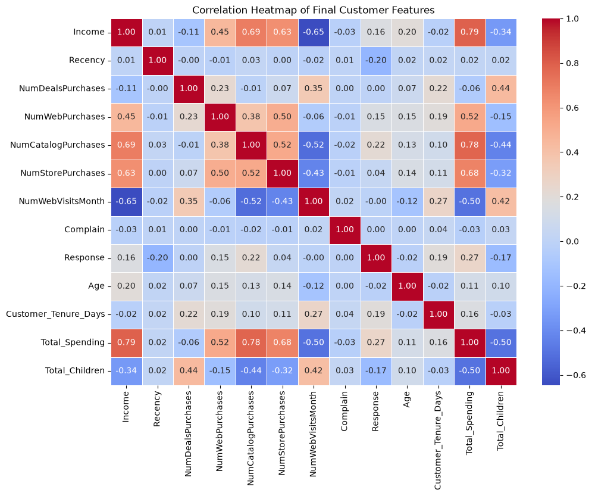
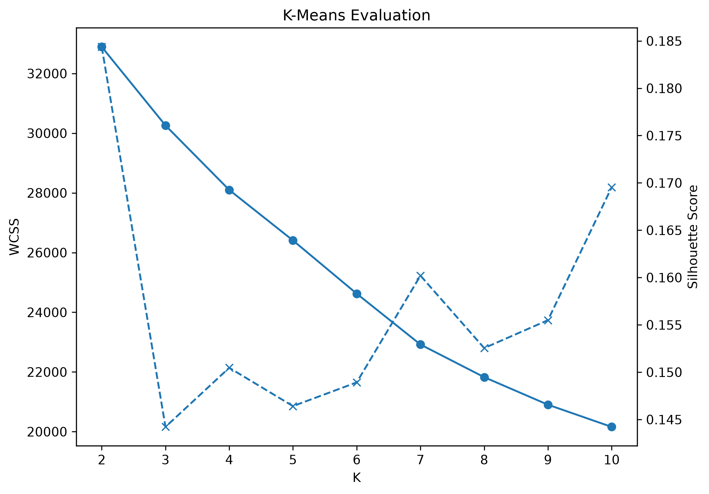
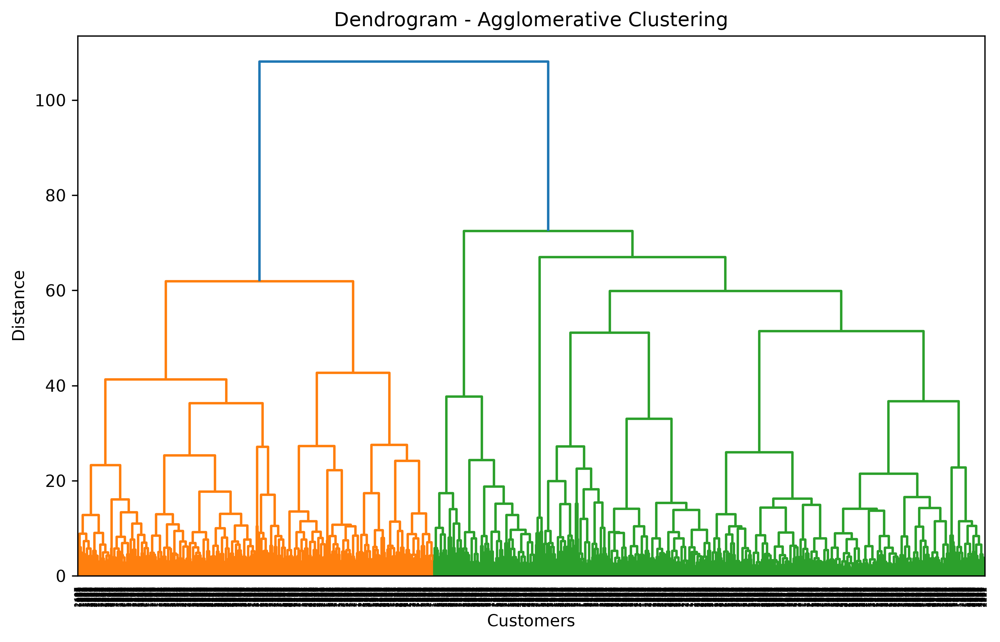
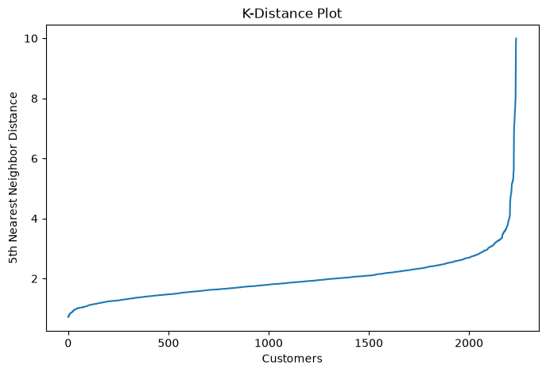
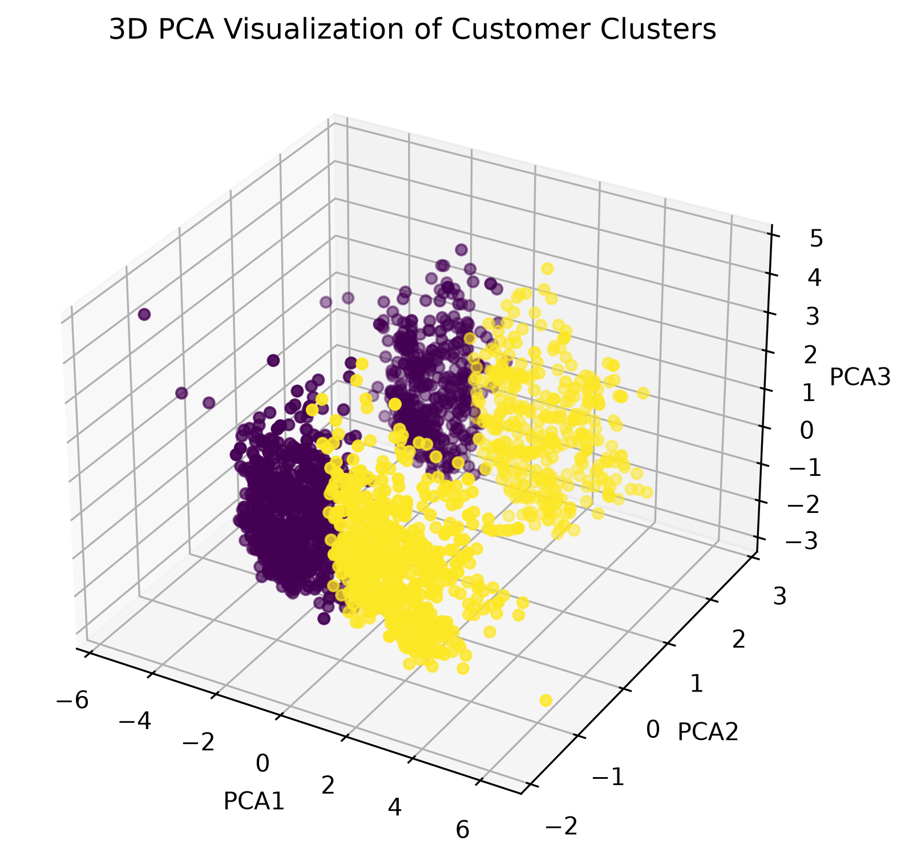
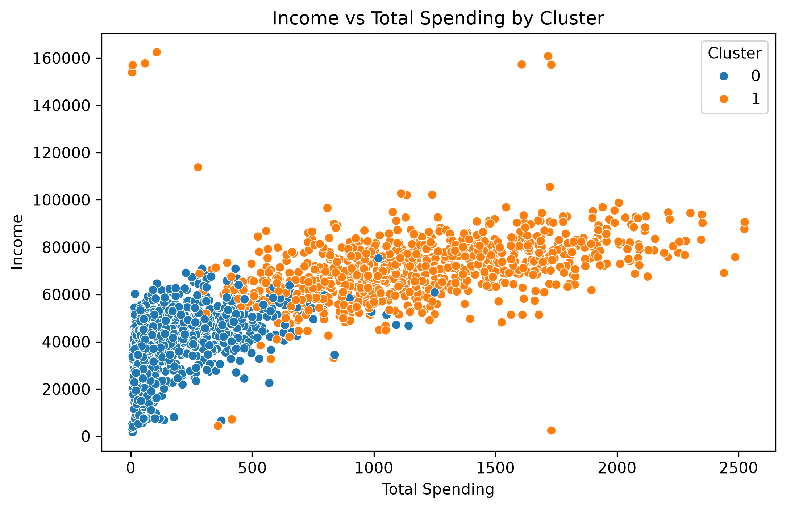

# SmartCart Customer Segmentation

An unsupervised machine learning project that segments e-commerce customers based on purchasing behavior, engagement, and customer characteristics to support targeted marketing and customer retention.

## Objective

The goal of this project is to identify meaningful customer segments from historical SmartCart customer data using unsupervised machine learning.

Multiple clustering algorithms are evaluated to identify the most suitable approach for broad customer segmentation.

## Dataset

- **Records:** 2,240 customers
- **Original Attributes:** 22
- **Domain:** E-commerce customer behavior
- **Key Features:** Income, Recency, spending, purchase channels, website activity, demographics, campaign response, and customer tenure

## Approach

1. Data preprocessing and missing-value handling
2. Feature engineering
3. Exploratory data analysis
4. Outlier detection and refinement
5. Categorical encoding
6. Feature standardization
7. K-Means clustering and evaluation
8. Agglomerative clustering with dendrogram analysis
9. DBSCAN clustering and parameter selection
10. Clustering algorithm comparison
11. PCA-based 3D visualization
12. Cluster characterization and business recommendations

## Clustering Results

Three clustering algorithms were evaluated on the standardized feature space.

| Algorithm | Clusters | Noise Points | Silhouette Score |
|---|---:|---:|---:|
| **K-Means** | **2** | 0 | **0.1844** |
| Agglomerative | 2 | 0 | 0.1497 |
| DBSCAN | 13 | 105 | 0.1331 |

K-Means was selected as the final clustering approach because it produced the highest Silhouette Score among the evaluated methods and provided a simple, interpretable two-cluster segmentation.

The Elbow Method and Kneed Method were also considered during K selection. Kneed identified K=3, while the highest Silhouette Score was obtained at K=2. K=2 was selected based on the overall evaluation and interpretability of the resulting customer groups.

## Customer Segments

### Cluster 0 – Low-Value Customers

- Average income of approximately 37K
- Much lower average spending
- Lower purchase activity across web, catalog, and store channels
- Lower campaign response

### Cluster 1 – High-Value Customers

- Average income of approximately 71K
- Much higher average spending
- Higher purchase activity across web, catalog, and store channels
- Higher campaign response

## Business Recommendations

### Cluster 0
- Use targeted discounts and promotional offers to encourage purchases.
- Use personalized campaigns to improve engagement and repeat purchases.

### Cluster 1
- Focus on retention through loyalty programs and exclusive offers.
- Provide personalized recommendations and premium promotions.

These segments allow SmartCart to apply targeted marketing strategies instead of using the same approach for all customers.

## Visualizations

### Correlation Heatmap



### K-Means Evaluation



### Agglomerative Clustering



### DBSCAN Parameter Selection



### PCA Cluster Visualization



### Customer Segmentation



## Tech Stack

- Python
- Pandas
- NumPy
- Matplotlib
- Seaborn
- Scikit-learn
- SciPy
- Kneed
- Jupyter Notebook

## Project Structure

```text
SmartCart/
│
├── SmartCart.ipynb
├── README.md
├── requirements.txt
├── .gitignore
│
└── images/
    ├── correlation_heatmap.png
    ├── dendrogram.png
    ├── income_vs_spending_clusters.png
    ├── k_distance_plot.png
    ├── kmeans_evaluation.png
    └── pca_3d_clusters.png

## Conclusion

The SmartCart customer dataset was analyzed using unsupervised machine learning to identify meaningful customer segments based on purchasing behavior, engagement, and customer characteristics.

After preprocessing, feature engineering, categorical encoding, and standardization, K-Means, Agglomerative Clustering, and DBSCAN were evaluated and compared.

K-Means with two clusters provided the most suitable broad segmentation, identifying lower-value and higher-value customer groups. These segments can help SmartCart design more targeted marketing, retention, and engagement strategies.